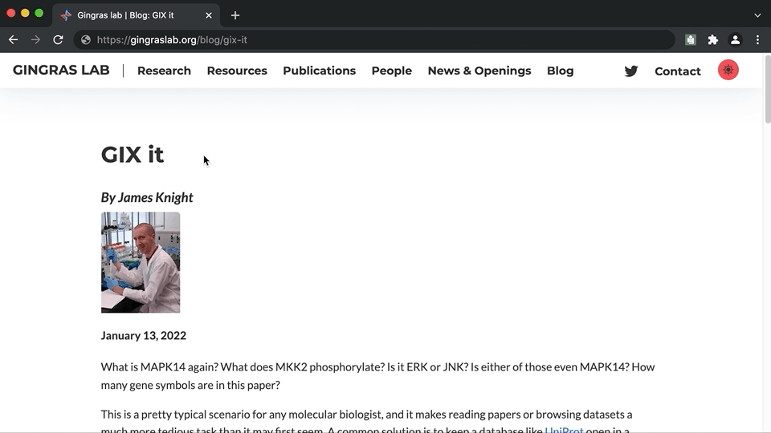
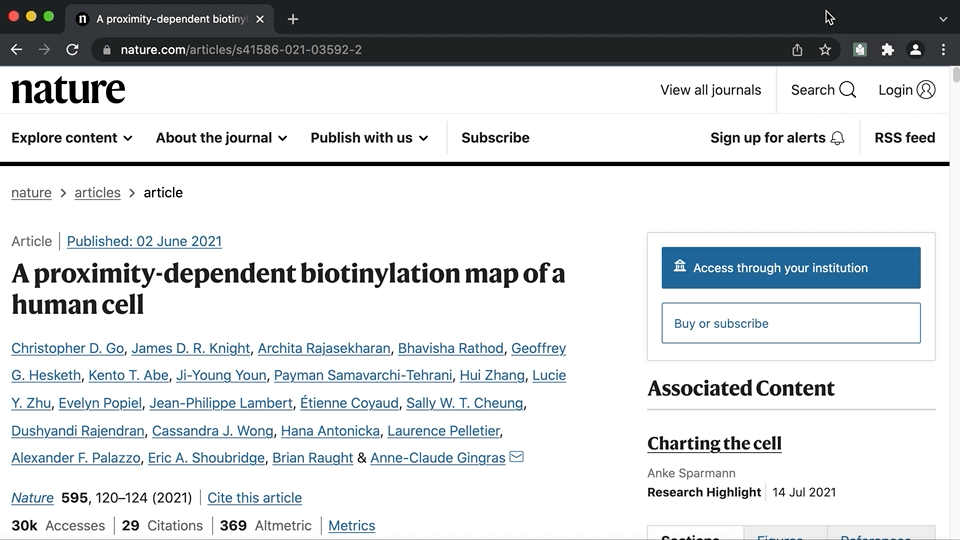
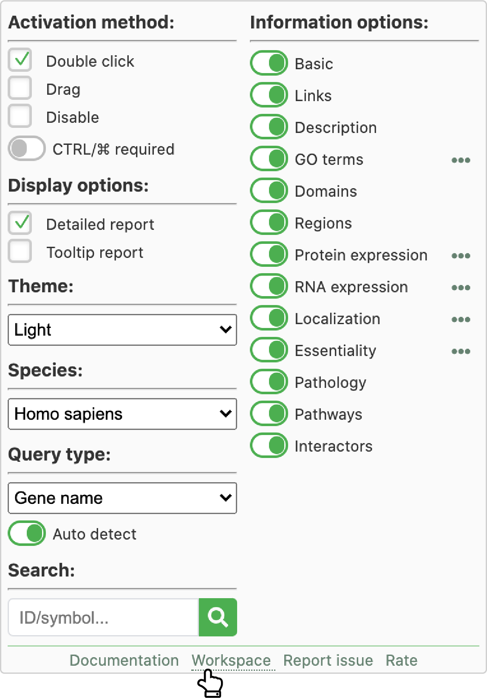

What is MAPK14 again? What does MKK2 phosphorylate? Is it ERK or JNK? Is either of those even MAPK14? How many gene symbols are in this paper?

This is a pretty common situation for any molecular biologist, and it can make reading a paper or browsing datasets a much more tedious task than it may first seem. A common solution is to keep a database like [UniProt](https://www.uniprot.org) open in a browser tab and copy-paste genes names into its search field, find the entry corresponding to the relevant species in the search results, and then finally parse through the report page for the needed information. And repeat this for every other gene symbol you come across.

Or instead, you could just double click on a symbol:

<figure class="blog-post__figure_border">

<figcaption>
  Simply double click on a gene symbol to retrieve information with GIX.
</figcaption>
</figure>

If you try that and it doesn’t work, that’s because you don’t have GIX. [GIX](https://gene-info.org), short for Gene Information eXtension, was designed by our lab to simplify the task of looking up gene information while reading papers or browsing online datasets. It will fetch and display the information directly on any website, allowing you to look something up quickly and easily without having to shift focus from the task at hand.

GIX provides extensive customization, including choosing from several different organisms, hiding information that is not of interest, and changing the order in which information appears on the displayed panel.

<figure class="blog-post__figure_border">

<figcaption>
  If you are not interested in RNA expression data, turn it off, or if localization is your major focus, move it to the top.
</figcaption>
</figure>

By default the extension will activate whenever you double click on something, which can get annoying as there are other reasons to double click on a web page. It's usually a good idea to turn on the &ldquo;CTRL/⌘ required&rdquo; option, which will require the `CONTROL` key to be held when double clicking on a Windows or Linux computer, or the `COMMAND (⌘)` key if you are on a Mac. This allows you to easily control when the extension in activated.

When a report for a gene opens up, that panel is now part of the web page you are viewing, which means if you see a gene in the report itself you'd like to know more about, you can simply double click to get information on it as well.

A little known fact about GIX is that it can query text in input fields, which is a convenient way for users to put their own gene symbols up &ldquo;on the web&rdquo; for querying. For example, if you have a column of gene symbols in an Excel file, you can copy the column to a form input and then begin double clicking. Rather than having people paste large lists into random form fields found around the web, we created a [workspace](https://gene-info.org/workspace), which is simply a large full-page text input box that does nothing on its own but serves as a place where users can type or paste large lists of gene symbols. This workspace can be accessed by clicking on the extension's icon and selecting the &ldquo;workspace&rdquo; link at the bottom.

<figure>

<figcaption>
  Click on the workspace link at the bottom to open a page where you can paste gene lists for querying with GIX.
</figcaption>
</figure>

GIX is smart enough to auto detect most gene identifiers, allowing you to double click on gene symbols, Ensembl IDs, Entrez gene IDs and UniProt accessions. On very rare occasions there will be a gene symbol that gets confused with a different identifier type and no result will be returned (the gene symbol B4GAT1 matches the characteristic UniProt accession pattern for example), in which case you simply need to disable the auto detect query type feature and specify what you want returned.

When we designed GIX, a major goal was to make information retrieval as fast as possible. Instead of live-querying different databases, putting you at the mercy of the slowest one, and having to parse the results on the fly, we merge all of that information into a single source database to give you the fastest experience possible. This requires regular updates to our database, but we certainly believe that is worth the effort. Currently GIX combines data from twelve sources, and we are grateful for the fantastic information they provide, without which GIX would not be possible. The sources are: [BioGRID](https://thebiogrid.org), [CompartmentsDB](https://compartments.jensenlab.org), [DepMap](https://depmap.org), [Gene Ontology](http://www.geneontology.org), [HGNC](https://www.genenames.org), [Human Protein Atlas](https://www.proteinatlas.org), [IntAct](https://www.ebi.ac.uk/intact), [OMIM](https://www.omim.org), [Pfam](https://pfam.xfam.org), [ProteomicsDB](https://www.proteomicsdb.org), [Reactome](https://reactome.org), and [UniProt](https://www.uniprot.org).

GIX is available for all major browsers (Chrome, Edge, Firefox and Safari), and you can find download links at [gene-info.org](https://gene-info.org).