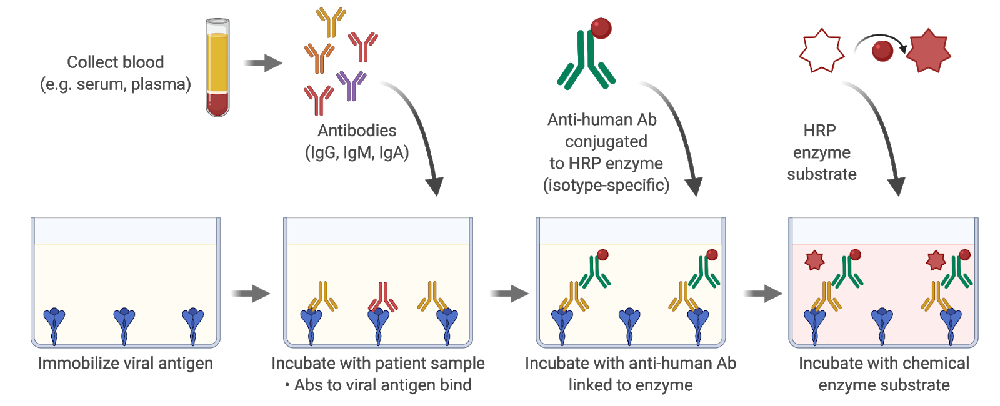
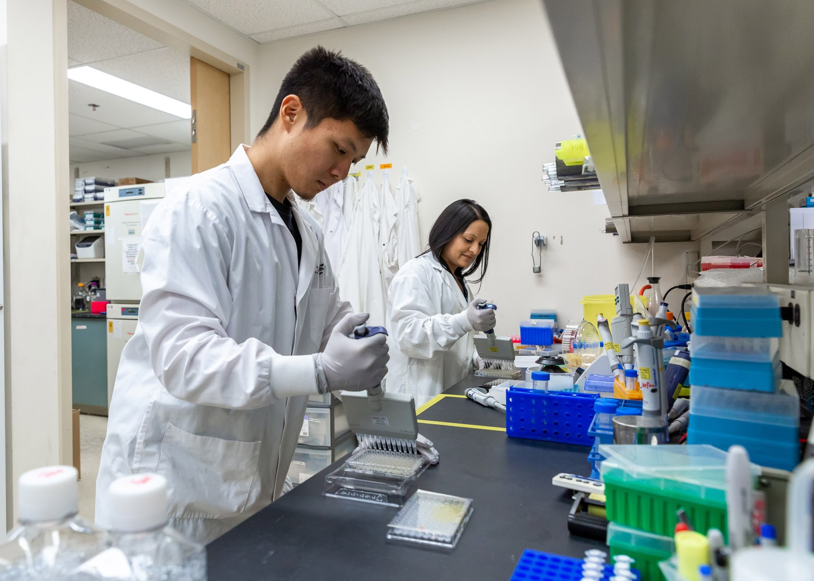
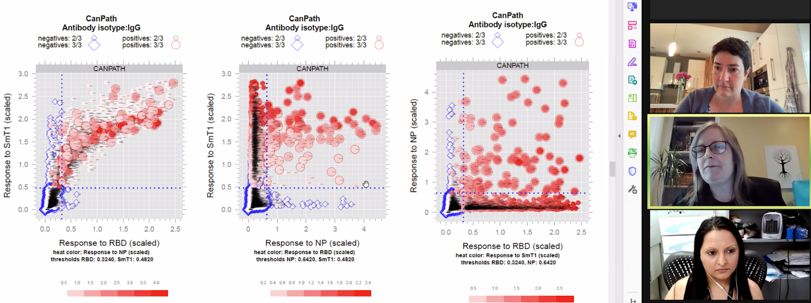

In March 2020, about one week had passed since the WHO declared that COVID-19 is a pandemic ([WHO Director-General's opening remarks at the media briefing on COVID-19 - 11 March 2020](https://www.who.int/director-general/speeches/detail/who-director-general-s-opening-remarks-at-the-media-briefing-on-covid-19---11-march-2020)). Fatima Amanat and Florian Krammer had just posted their first preprint on a serological assay for COVID-19: [A serological assay to detect SARS-CoV-2 seroconversion in humans](https://www.medrxiv.org/content/10.1101/2020.03.17.20037713v1). In this manuscript, they described the production of proteins derived from SARS-CoV-2 and setting-up what is known in the field as an ELISA assay (acronym for Enzyme-Linked ImmunoSorbent Assay). In an ELISA, we attach a protein at the bottom of a well in a plastic plate and then add a sample, typically the serum component of blood, to the well to test for the presence of antibodies. These antibodies can recognize the protein, or “antigens,”  attached to the bottom of the well. We then remove the serum and add another antibody that can bind to any human antibody of a given type, such as the IgG antibody. This second antibody is also connected to an enzyme. Once you wash away the antibodies that have not been able to attach, you then provide the enzyme with a “substrate” upon which the enzyme will act to create a change in color or the emission of light, which you detect with a specific instrument. The Amanat and Krammer study succeeded in creating a manual colorimetric assay for the spike protein located on the surface of the SARS-CoV-2 virus and another one for the receptor binding domain of spike, that is responsible for binding to the protein ACE2 on the cells of the human host.

<figure>

<figcaption>
  Description of the ELISA assay used at the LTRI for the detection of antibodies to SARS-CoV-2 proteins. Created with BioRender.com.
</figcaption>
</figure>

This immediately caught my attention and I forwarded the preprint to my colleague Jeff Wrana with whom I co-direct the [Network Biology Collaborative Centre, NBCC](nbcc.lunenfeld.ca) at the Lunenfeld-Tanenbaum Research Institute (LTRI). This centre was developed thanks to funding from the Canadian Foundation for Innovation, Genome Canada and the government of Ontario, and it contains a suite of advanced instrumentation for systematically probing biological systems. One of the arms of the NBCC, led by Jeff, specializes in the automation of assays, including for protein-protein interactions. The binding of an antibody to an antigen (here a viral protein) is a relatively easy type of protein interaction to measure, since the binding affinity (how strongly the antibody binds to the target) is quite high. We felt that we were in a unique position to turn the manual assay reported by the Krammer group into an automated high-throughput assay that would enable us to test thousands of samples simultaneously.

We also believed that the high quality of the results reported in the Amanat/Krammer preprint should enable a clear diagnosis of individuals who have been previously infected with SARS-CoV-2. At the time, in Canada, testing for the presence of SARS-CoV-2 viral RNA (using a technique known as RT-PCR) was limited to people with a travelling history or of contact with travellers or confirmed cases. Any cases caught via community transmission, a huge driver of the pandemic, would have been missed. Within two days of the first email to Jeff Wrana, others had come together to help. Miriam Barrios-Rodiles, manager of the NBCC high-throughput screening facility, proposed a 384-well luminescence format for the assay, and connected with protein purification expert Yves Durocher at the National Research Council of Canada, NRC, who was setting up spike and RBD purification. Three days later, we also recruited on the “antigen team” from the University of Toronto, including James Rini, an expert in the structural biology of spike proteins, who was also in the process of purifying spike and RBD. Jeff also contacted Ken Hughes at Microbix, who provided protein from spike but also from the nucleocapsid protein. The nucleocapsid was not included in the Amanat/Krammer preprint, but this is a highly immunogenic protein, and many of the commercial assays are based upon its detection. We thought that including a nucleocapsid antigen as part of our screening strategy would increase the confidence in the identification of people with evidence of prior infection (and, as it turns out, this is now critically important to distinguish immunity originating from natural infection, which should induce a nucleocapsid response, from those of the vaccines). Eventually, we ended up using a nucleocapsid protein produced by Derek Ceccarelli in the Sicheri lab at LTRI, the RBD from James Rini and the spike trimer protein from Yves Durocher at the NRC.  As time went by, we also realized that a high-quality, sustainable and shareable (at least within the country) source of antigens was necessary, and this was made possible by a complete switch to antigens produced by the Durocher team at the NRC who also generated reagents for the detection of the antibodies, and also for calibration between assays (and eventually across laboratories). This collaboration with the NRC became the cornerstone of “made-in-Canada” serology testing.

Having antigens (and the original protocols from Amanat/Krammer) was a necessary first step, but having access to samples to test them on was just as critical. Tara Moriarty and Karen Maxwell from the University of Toronto helped connect us to a team of immunologists at the University of Toronto, including Jen Gommerman and Mario Ostrowski. Mario in particular had taken large volume blood draws from some of the first patients with COVID-19 in Toronto, and Jen had banked pre-COVID era serum which she was able to share with us. In the days/weeks that followed, Allison McGeer and her colleagues at the Toronto Invasive Bacterial Disease Network (TIBDN) were able to provide additional samples from acute and convalescent patients, and she linked us with the Canadian Blood Services (CBS; Steve Drews) and the National Microbiology Laboratory of Canada (NML; Mike Drebot) who provided further samples for test development. 

With samples and antigens in hand, all we needed was a “dream team” of experimentalists to set-up and perform the assays, first in manual and then in automated fashion. We were already thinking about developing assays that not only measure the quantity of the antibodies produced, but also whether these antibodies are capable of preventing one of the most important steps in infection, spike protein binding to the receptor protein ACE2, which is on the surface of the host cells. The task of setting up and optimizing these assays was accomplished in record-time by a PhD student in my lab, Kento Abe, and my lab manager, research technician Bhavisha Rathod. They optimized all assay conditions to detect antibodies to each of the three antigens, and they developed different assays to look at different types of antibodies (IgG, IgA and IgM).  They tested dozens of conditions and several hundreds of samples manually until they were satisfied that the assay was working properly, and then worked with the robotics team to transfer the assay to the automated platform. Jenny Wang, automation specialist within the NBCC, and Miriam Barrios-Rodiles worked on transferring the manual assay to an automated assay that uses four times less material per assay and provides a more sensitive signal (Jenny is currently trying to further increase the throughput of the assay). They were able to demonstrate that the automated assay performed well and that if the same sample was analyzed twice with the same test, it returned the same results both times. Together, the team was then able to take a large number of samples that had been collected prior to the COVID-19 pandemic (presumed negatives, about 300), and confirmed COVID-19 samples (provided by the CBS, Mario Ostrowski or Allison McGeer and the TIBDN team; also about 300), so that we could define what was the sensitivity and the specificity of each individual assay. In other words, how many of the pre-COVID serum samples would be (falsely) called positive by each individual assays (false positive rate, a measure of specificity) and how many samples from convalescent individuals with confirmed SARS-CoV-2 infection would be correctly identified as positive (sensitivity). We also realized early on that requiring a sample to score “positive” on two or more of the three assays really helped us reduce the false positive rate, while maintaining the sensitivity at an acceptable rate. This strategy is particularly important if the expected seroprevalence is low as it was in Canada in the first waves of infection, and prior to the introduction of vaccination.

<figure>

<figcaption>
  PhD student Kento Abe and research technician Bhavisha Rathod, seen optimizing the manual ELISA assay. Picture courtesy of Sinai Health.
</figcaption>
</figure>

Our first large-scale application of the automated assays included measurements of IgG, IgA and IgM to the three antigens spike, RBD and the nucleocapsid. We performed these measurements on nearly 500 serum samples from patients with an acute COVID-19 infection (all collected through the TIBDN in Toronto) to look at the dynamics of antibody production in the three to four months following an infection. The profiling by the Gommerman team of antibodies in the saliva enabled us to compare serum and saliva antibody levels for many of the same patients, and to conclude that saliva is an appropriate alternative body fluid for antibody measurements. We also were able to report, in agreement with several other reports published around the same time and since then, that IgG but not IgA or IgM are still detectable many months after the infection. The study was published online in October 2020 (with students Baweleta Isho, Kento Abe, Michelle Zuo and Alainna Jamal sharing co-first authorship; [Persistence of serum and saliva antibody responses to SARS-CoV-2 spike antigens in COVID-19 patients](https://immunology.sciencemag.org/content/5/52/eabe5511)). 

Our success in setting up these assays on an automated platform rapidly drew the attention of other groups that were interested in looking at antibodies to SARS-CoV-2 proteins for either immune correlates or seroprevalence studies (most of the studies that are still ongoing have now pivoted to vaccine response studies). This would involve more than 25 projects, with 80,000 samples processed so far (the majority with three assays per sample). Each of the projects comes with unique challenges, including different labeling schemes, sample types (liquid blood, dried blood spots), requirement for measurements of different antibodies, timelines for reporting to participants, etc. The logistics associated with these projects therefore require a high level of organization and tracking, both on the administrative side and on the ground, and the development of quality control steps and automated data analysis and visualization tools.

Throughout this process, NBCC manager Karen Colwill played a critical support role. She made sure that we had material transfer agreements and research ethics board approvals in place, worked on our biosafety protocols, and coordinated with Bhavisha Rathod and Miriam Barrios-Rodiles to order materia, which, as it turns out, was not an easy task in pandemic times, with delays and shortages affecting the availability of plasticware that is necessary for the assays. As we moved into production mode with the high-throughput ELISA assays, Karen took on an increasingly important role, including tracking projects and scheduling samples to be run, and manually reviewing the data generated in each batch and reporting the results to the project leads. On the ground, Bhavisha Rathod held down the fort and worked with a team of recently-recruited individuals (Mahya Fazel-Zarandi, Mariam Iskilova, Queenie Hu, Monica Dayam) to receive all the samples, make sure that any potential virus was inactivated, prepare them for analysis in automated runs, and store the remaining samples properly.

<figure>

<figcaption>
  Karen Colwill (centre right) reviewing the results for a seroprevalence and vaccination study at a team meeting. Also pictured: Bhavisha Rathod (bottom) and Anne-Claude Gingras (top). The visualization show has been developed by Adrian Pasculescu.
</figcaption>
</figure>

While our assay relies on automation, the initial sample intake is very much manual and varies for each project. For example, in a recent serology surveillance study run by Statistics Canada using dried blood spot cards, samples came individually packed in a small envelope, with 10 envelopes placed into a small plastic bag and these bags packaged inside a large container. Each outside bag, then inside envelope, needed to be opened, the barcode on the dried blood spot card read, and a small portion of the dried blood spot cut out with a laser puncher into a plate containing 96 separate wells. Then the card needed to be put back into its place and stored safely. The antibodies contained on the dried blood spot needed to be extracted by the addition of a liquid containing detergent before they could be brought to the robot for the assays. In some other projects, liquid blood product (most often serum) is provided, most of the time frozen, and hand-written or typed labels instead of barcodes are often affixed to the samples. These sample identifiers must be manually transferred to our database and verified so errors are not made. The serum is transferred to a well of a 96-well plate that contains detergent to inactivate any potential virus in a specific order before being brought to the robot. The automated runs are set-up by Jenny Wang (and more recently Mariam Iskilova and Mahya Fazel-Zarandi), and the results are transferred by the operator to our server.  Biostatistician Adrian Pasculescu created automated scripts to perform quality control checks and extract the data for all the test samples in a given batch. We always express the values detected in an assay against those detected with a calibration standard since this makes it easier to compare the studies from day to day. Both Adrian and Kento Abe developed other visualization and analysis tools that make it easier to see what are the levels of antibodies in a specific sample or across multiple samples within a project.  This also facilitates communication with our external partners, and the preparation of data for publication.

Each person has a critically important role to play in the development of these assays or their implementation across projects. Teamwork and communication are critically important, as is the leadership of team leads. We also have developed complementary assays that are not currently amenable to automation, but provide critical information on the ability of antibodies to block the entry of a virus into cells (these assays were developed by PhD student Reuben Samson with former postdoctoral fellow Payman Samavarchi-Tehrani and are now performed by Queenie Hu and Reuben). Importantly, we have worked closely with different investigators across the country to profile antibody levels across multiple cohorts. These interactions have been rewarding to the team, especially as our work may have helped inform some public health decisions.  

Throughout this endeavour, we have been fortunate to secure funding that has allowed us to set-up the assays, notably through the Sinai Health Foundation that secured donations from the RBC Foundation, the Krembil Foundation and QuestCap early in the pandemic. Our collaborations/services to different research projects have led to additional funding primarily through the CIHR, the Ontario government and more recently the COVID-19 Immunity Task Force.

In this piece, I only focused on the contributions of our team at the LTRI and NBCC and our close collaborators in setting-up the automated ELISA assays. Future blog spots will highlight some of the important projects we are assisting using these assays.